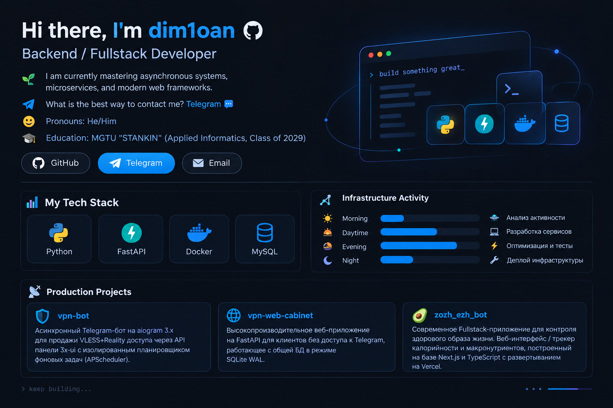

  

# Hi there, I'm dim1oan 

## I'm a Backend / Fullstack Developer

- 🌱 I am currently mastering asynchronous systems, microservices, and modern web frameworks.
- 📫 What is the best way to contact me? [Telegram](https://t.me/dim1oan) 💬
- 😄 Pronouns: He/Him
- 🎓 Education: MGTU "STANKIN" (Applied Informatics, Class of 2029)

---

### My Tech Stack 🧰

---

### Production Projects 📡

* 🛡️ **[vpn-bot](https://github.com)** — Асинхронный Telegram-бот на aiogram 3.x для продажи VLESS+Reality доступа через API панели 3x-ui с изолированным планировщиком фоновых задач (`APScheduler`).
* 🌐 **[vpn-web-cabinet](https://github.com)** — Высокопроизводительное веб-приложение на FastAPI для клиентов без доступа к Telegram, работающее с общей БД в режиме `SQLite WAL`.
* 🥑 **[zozh_ezh_bot](https://github.com/dim1oan/zozh_ezh_bot)** — Современное Fullstack-приложение для контроля здорового образа жизни. Веб-интерфейс / трекер калорийности и макронутриентов, построенный на базе **Next.js** и **TypeScript** с развертыванием на Vercel.

